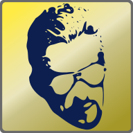

# cso2-starter



](https://ci.appveyor.com/project/L-Leite/cso2-starter)

A launch manager for Counter-Strike Online 2

## Download 
Get the latest build of cso2-starter [here](https://github.com/L-Leite/cso2-starter/releases/latest).

## Building

### Requirements
- [CMake](https://cmake.org/download/)
- [Qt](https://www.qt.io/download)
- A C++17 compiler

#### With Visual Studio

You can generate project files for Visual Studio 15 by running the follwing commands:

```sh
# Create and go to the build directory
mkdir build
cd build

# Generate oroject files
cmake -G "Visual Studio 16 2019" -A "x64" ../
```

You can then build the solution file `cso2-starter.sln`.

#### With Ninja

Use the following commands to setup and build with Ninja:

```sh
# Create and go to the build directory
mkdir build
cd build

# Generate ninja files
cmake -G "Ninja" -DCMAKE_BUILD_TYPE="Release" ../

# To build the project
ninja all
```

## Libraries used

cso2-starter uses the following libraries:

- [Breeze Icon Theme](https://cgit.kde.org/breeze-icons.git/), LGPL.

## License

cso2-starter is distributed under the GNU GPLv3 license

